<div align="center">


# FetchCart AI — Frontend

### *Shop smarter with AI. Save more.*

> An AI-powered product discovery and comparison platform. Search any product in plain language, compare prices across every major marketplace, and make smarter buying decisions — all in one place.

[](https://react.dev)
[](https://www.typescriptlang.org)
[](https://vitejs.dev)
[](https://tailwindcss.com)

</div>

---

## Overview

FetchCart AI's frontend is a modern, responsive React application that lets users search for products using natural language, see live search progress, explore and compare product results, and manage their search history — all within a clean, dark-themed interface.

---

## Screenshots

### 1. Landing Page — Hero Section
> The main landing page with the "Shop smarter with AI" headline, product search preview, and CTAs.

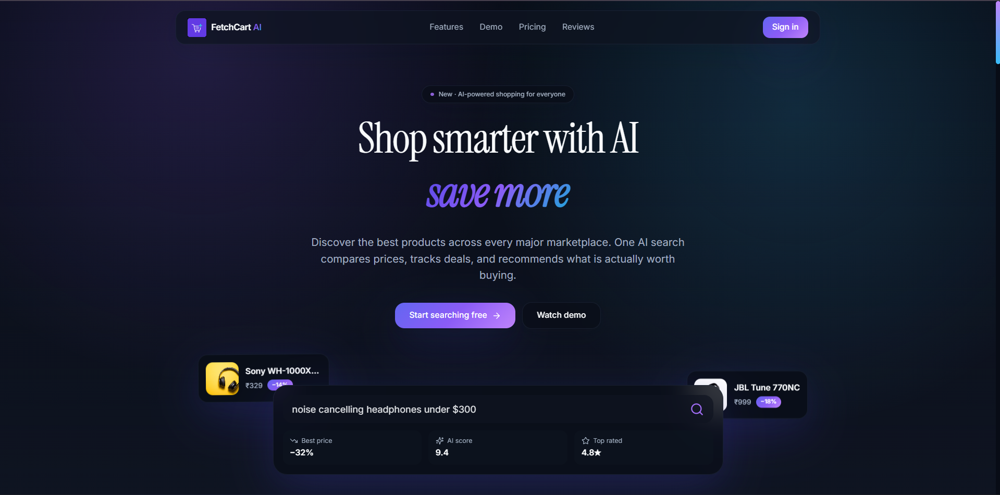

---

### 2. Authentication Page
> Split-screen login/signup page with Google OAuth and email/password support.

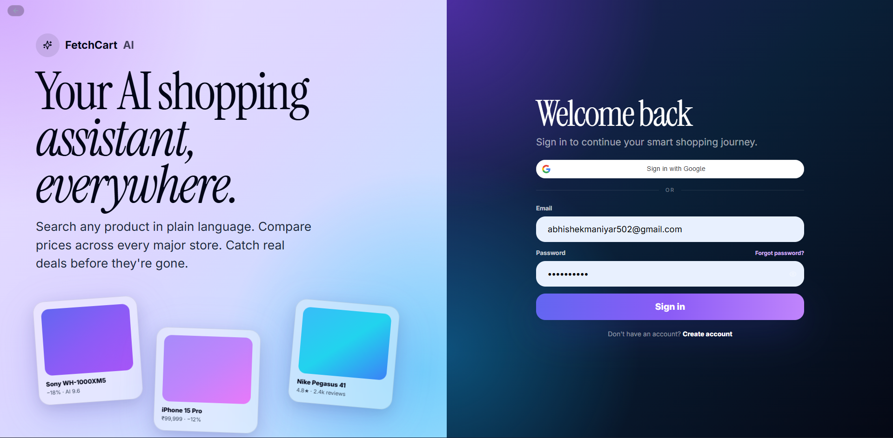
---

### 3. Billing & Subscription
> Plan selection page showing Pro Monthly and Max Monthly tiers with a live payment summary panel and Razorpay checkout.

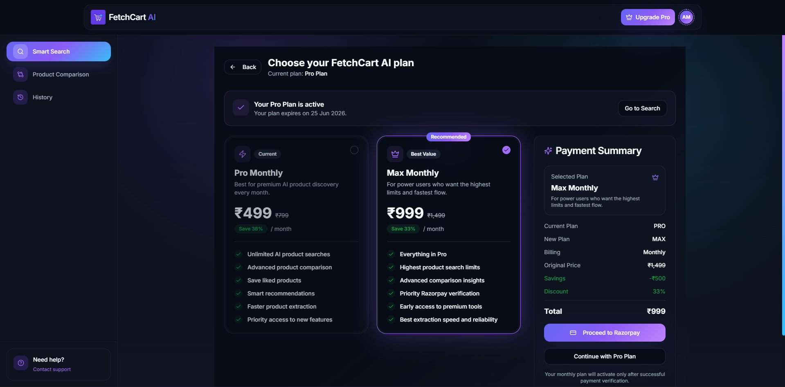

---

### 4. AI Product Comparison — Results
> Side-by-side AI comparison view showing an AI-generated summary, winner highlight, and full product cards with specs and pricing.

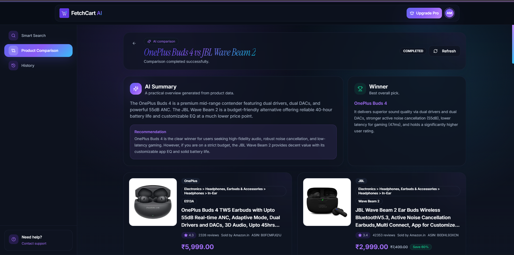

---

### 5. Search Results
> Product result cards showing images, title, price, discount, rating, review count, and store — with Buy Now and Compare actions.

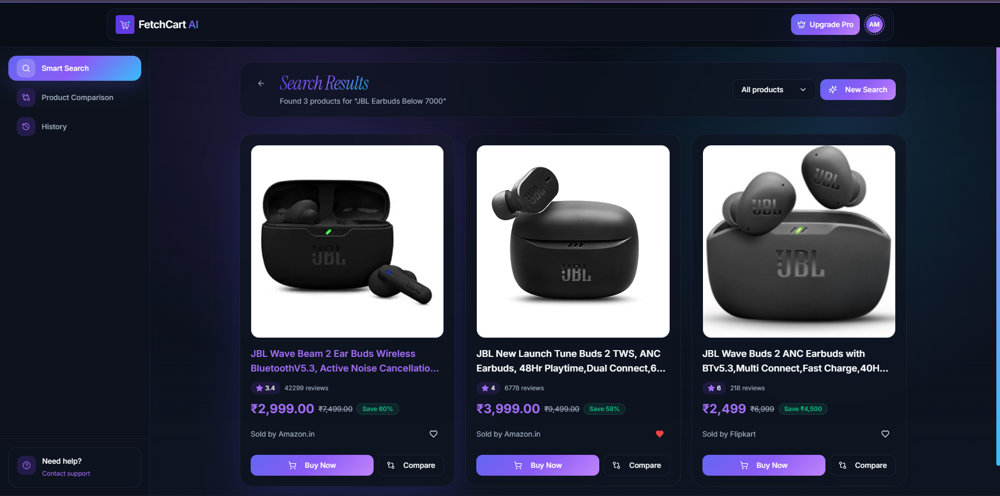

---

### 6. History — Comparisons Tab
> The History page showing past product comparison sessions with status badges (Completed, Failed, Unknown) and timestamps.

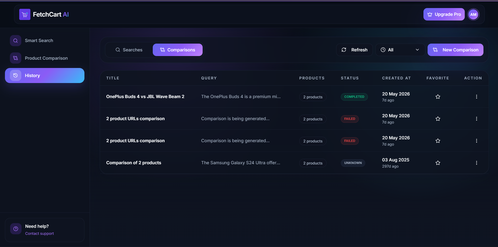

---

### 7. History — Searches Tab
> The History page showing past smart search sessions with query titles, result counts, status, and favoriting.

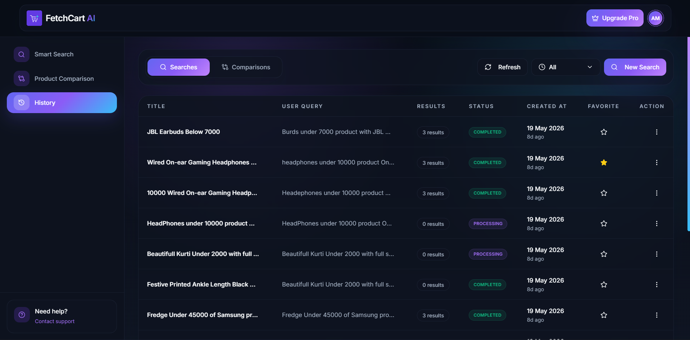
---

### 8. Product Comparison — Create
> The comparison creation screen where users paste two product URLs to trigger an AI comparison.

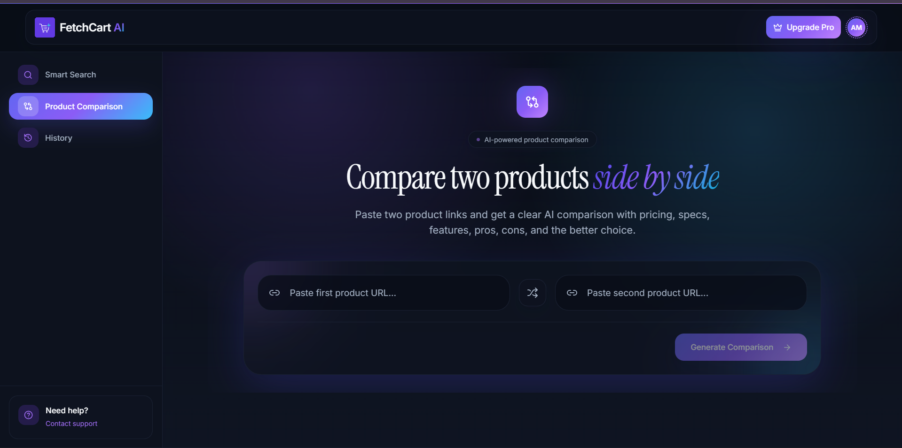
---

### 9. Smart Search Interface
> The AI-powered search input page. Users describe what they need naturally; suggestion chips help with common queries.

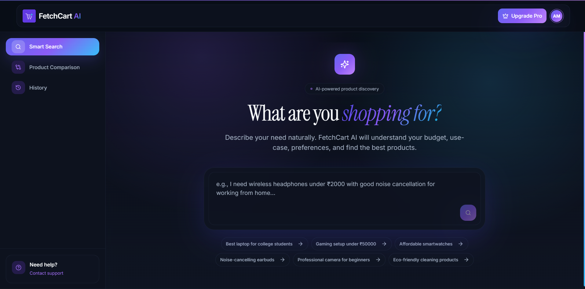
---

### 10. Reset Password
> Secure password reset page with real-time password strength validation (length, number, letter checks).

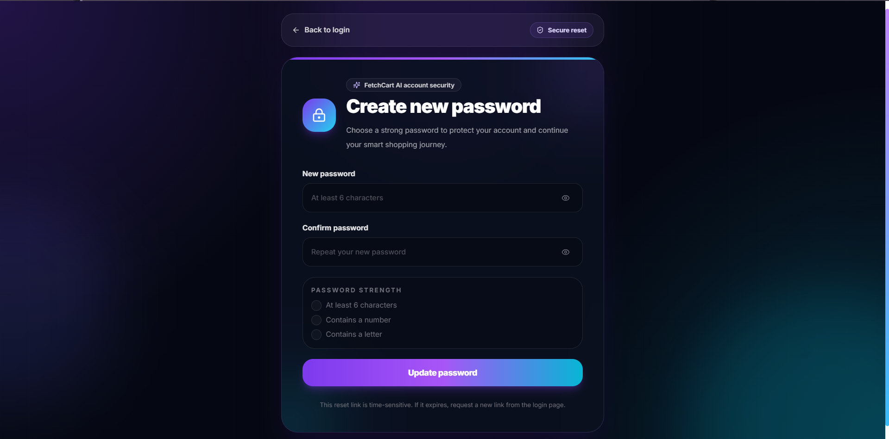
---

### 11. Email Verification
> Email verification loading screen with a secure token validation message shown after registration.

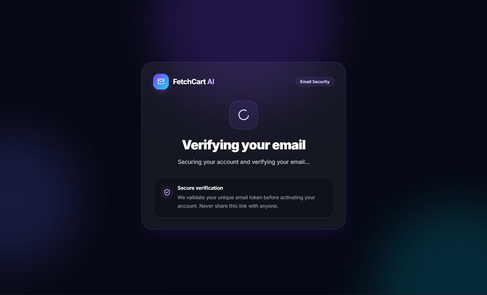

---

## Key Features

- **AI-Powered Smart Search** — Describe any product in natural language with budget, use-case, and preferences
- **Real-Time Search Progress** — Live WebSocket updates while the backend discovers and extracts products
- **Product Result Cards** — Price, discount, rating, review count, store name, and images in one view
- **Like / Save Products** — Bookmark favourite product results across sessions
- **Product Comparison Tool** — Paste two product URLs for a detailed AI head-to-head analysis with a declared winner
- **Search & Comparison History** — Full history with status, timestamps, favouriting, and re-access
- **Subscription & Billing** — Plan selection (Free / Pro / Max) with Razorpay payment integration
- **Authentication** — Email/password login, Google OAuth, JWT-based sessions
- **Forgot Password Flow** — Secure password reset via email link with strength validation
- **Email Verification** — Token-based account verification on signup
- **Responsive Dark UI** — Clean, modern dashboard experience with sidebar navigation

---

## Tech Stack

| Category | Technology |
|---|---|
| Framework | React 18 + TypeScript |
| Build Tool | Vite |
| Styling | Tailwind CSS + shadcn/ui |
| Animation | Framer Motion |
| Routing | React Router v6 |
| Server State | TanStack Query (React Query) |
| Client State | Zustand |
| HTTP Client | Axios |
| Real-Time | WebSocket (`useSearchSocket`) |
| Payments | Razorpay JS SDK |
| Forms | React Hook Form |
| Icons | Lucide React |

---

## Project Structure

```
fetchcart-frontend/
├── public/                  # Static assets (store logos, app logo)
├── src/
│   ├── api/                 # API call functions (auth, search, compare, product, payment)
│   ├── components/
│   │   ├── SmartSearch/     # Search input and main content components
│   │   ├── common/          # Header and Sidebar
│   │   └── ui/              # shadcn/ui component library
│   ├── config/              # API base URL config
│   ├── constants/           # Enums for auth and search
│   ├── hooks/               # Custom hooks (auth, search, compare, payment, WebSocket)
│   ├── lib/                 # Axios instance, Razorpay loader, utils
│   ├── pages/               # Route-level page components
│   ├── store/               # Zustand stores (app state, user state)
│   └── types/               # TypeScript type definitions
```

---

## Page Routes

| Route | Component | Description |
|---|---|---|
| `/` | `LandingPage` | Public marketing homepage |
| `/auth` | `AuthPage` | Login / signup |
| `/verify-email` | `VerifyEmailPage` | Email token verification |
| `/reset-password` | `ResetPasswordPage` | Password reset form |
| `/dashboard/search` | `SearchCreatePage` | Smart search entry |
| `/dashboard/search/:id` | `SearchPage` | Search results view |
| `/dashboard/compare` | `CompareCreatePage` | Comparison URL input |
| `/dashboard/compare/:id` | `ComparePage` | Comparison results |
| `/dashboard/history` | `HistoryPage` | Search and comparison history |
| `/checkout` | `CheckoutPage` | Billing and plan upgrade |

---

## AI-Powered Search Flow

```
User enters natural language query
        ↓
POST /search/create  →  Job queued on backend
        ↓
WebSocket connection opened  →  Real-time progress updates
        ↓
Products discovered, extracted, normalised
        ↓
Search results rendered with cards
```

---

## Authentication Flow

```
Register (email + password)
        ↓
Verification email sent  →  /verify-email?token=...
        ↓
Account activated  →  Redirect to dashboard

──── OR ────

Google OAuth  →  JWT issued  →  Dashboard
```

---

## Billing Flow

```
User clicks "Upgrade Pro"
        ↓
/checkout  →  Plan selection (Pro / Max)
        ↓
Payment summary panel updates
        ↓
"Proceed to Razorpay"  →  Razorpay checkout modal
        ↓
Payment verified  →  Plan activated
```

---

## Getting Started

### Prerequisites

- Node.js >= 18
- npm or bun

### Installation

```bash
git clone https://github.com/your-username/fetchcart-frontend.git
cd fetchcart-frontend
npm install
```

### Development

```bash
npm run dev
```

### Build

```bash
npm run build
```

### Preview Production Build

```bash
npm run preview
```

---

## Environment Variables

Create a `.env` file in the root:

```env
VITE_API_BASE_URL=http://localhost:4000/api
VITE_WS_URL=ws://localhost:4000
VITE_RAZORPAY_KEY_ID=rzp_test_xxxxxxxxxxxx
VITE_GOOGLE_CLIENT_ID=your-google-client-id
```

---

## API Overview

All API calls live in `src/api/` and are consumed via TanStack Query hooks in `src/hooks/`.

| Module | File | Endpoints |
|---|---|---|
| Auth | `auth.api.ts` | Register, Login, Google OAuth, Verify Email, Reset Password |
| Search | `search.api.ts` | Create search, Get results, Get history |
| Compare | `compare.api.ts` | Create comparison, Get results, Get history |
| Product | `product.api.ts` | Like/unlike product, Get product details |
| Payment | `payment.api.ts` | Create order, Verify payment, Get plans |

---

## Future Improvements

- Price drop alerts and watchlist notifications
- Product category filters and sorting in search results
- AI-generated buying guides from search results
- Multi-product comparison (3+ products)
- Browser extension for in-page comparison
- Mobile app (React Native)
- Personalised recommendations based on search history

---

## Author

**Abhishek Maniyar**
- GitHub: [@abhishekmaniy](https://github.com/abhishekmaniy)
- Email: abhishekmaniyar502@gmail.com

---

## License

This project is licensed under the [MIT License](./LICENSE).